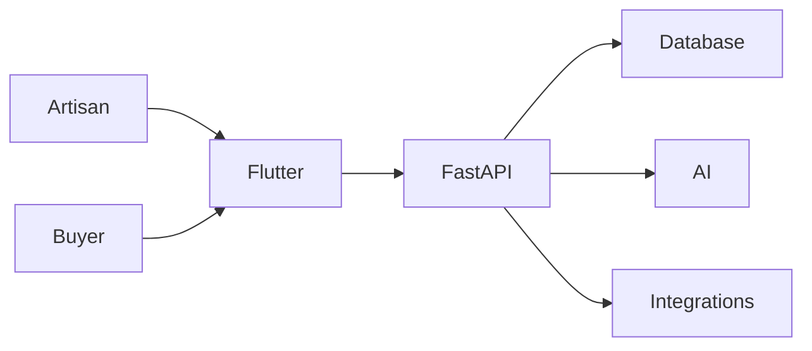

<div align="center">

# Craftsy

### Where Artisan Hands Meet Digital Markets

**An AI-powered mobile platform that transforms a single photo and a spoken sentence into a professional, fairly-priced, bilingual product listing — purpose-built for India's rural artisans.**

*Smart India Hackathon 2026 · PS-90 · Heritage & Culture*

[](https://flutter.dev)
[](https://fastapi.tiangolo.com)
[](https://www.postgresql.org)
[](https://www.trychroma.com)
[]()
[](#license)

</div>

---

## ✨ Highlights

- **🤖 AI-Powered Listings** — One photo + one voice note → professional English + Hindi product title, description, tags, and pricing guidance.
- **🌐 12+ Languages** — Full app support across English, Hindi, Gujarati, Punjabi, Urdu, Odia, Assamese, Telugu, Tamil, Bengali, Marathi, and Kannada.
- **📱 Offline-First** — Works without internet. Drafts, photos, and voice notes are saved locally and sync automatically when connectivity returns.
- **🛒 Craftsy Marketplace** — Every live product by any artisan is instantly visible and purchasable in the public marketplace.
- **📦 Multi-Channel Commerce** — Publish to Craftsy Marketplace, ONDC, and GeM from one product. Track channel status, enable/disable channels, and audit every change.
- **🎯 Business Advisor** — AI-driven guidance on pricing, stock levels, festival demand, and product visibility.
- **♿ Accessible by Design** — Text-to-speech readback, large-text mode, haptic feedback, and voice navigation for every screen.
- **🔒 Secure Onboarding** — Phone + OTP authentication with auto-OTP fill and smooth keyboard navigation.

---

## 📲 Download

**Android App (APK)**

[Download Craftsy Latest Release](https://github.com/mdxcodes/craftsy/releases/latest)

> Direct APK download. Install and enable installs from unknown sources when prompted.

**Live API**
https://web-production-8ece9b.up.railway.app/api/v1/health

**Swagger Docs**
https://web-production-8ece9b.up.railway.app/docs

---

## 🎬 What You Can Do

<table>
<tr><td width="50%">

### For Artisans
- Snap a product photo and record a voice description
- Review AI-generated bilingual listings before publishing
- Manage inventory, pricing, and stock across all channels
- Track orders and earnings in one unified dashboard
- Get smart suggestions to improve listings and sales

</td><td width="50%">

### For Buyers
- Browse the full Craftsy marketplace with live artisan products
- Search and filter by category
- View product details, artisan info, and channel status
- Add items to cart and complete checkout

</td></tr>
</table>

---

## 🧠 How It Works



1. **Capture** — Photograph the product and describe it in your voice.
2. **Enhance** — AI removes backgrounds, corrects lighting, and prepares a studio-quality image.
3. **Generate** — Speech-to-text + LLM produces a polished bilingual title, description, and tags.
4. **Price** — ChromaDB retrieves real market benchmarks and suggests a fair price.
5. **Publish** — List on Craftsy Marketplace, ONDC, GeM — or all three — with one tap.

---

## 🚀 Key Features

| Feature | Details |
|---|---|
| **AI Listing Engine** | Background removal, lighting correction, speech transcription, bilingual listing generation, and smart pricing |
| **Bilingual Catalog** | English + Hindi titles and descriptions for every product |
| **Offline Sync** | Local-first architecture with background queue; no lost drafts |
| **Multi-Channel Status** | Real-time channel health for Craftsy, ONDC, and GeM |
| **Cart & Orders** | Full cart flow, order placement, and unified order tracking |
| **Business Advisor** | Festival demand alerts, pricing nudges, and stock recommendations |
| **Accessibility** | TTS, large text, haptics, and voice-first navigation |
| **12+ Languages** | Full UI localization across major Indian languages |
| **AI Chat Assistant** | Context-aware help for listings, orders, pricing, and platform navigation |

---

## 🛠️ Technology Stack

| Layer | Technology | Purpose |
|---|---|---|
| Mobile | Flutter, Dart | Cross-platform client with offline-first local storage |
| State | Riverpod | Reactive state management |
| Local DB | Hive | Offline queue and cached drafts |
| Background sync | WorkManager | Periodic drain of upload queue |
| Backend | FastAPI, SQLAlchemy 2.0 | REST API and ORM |
| Database | PostgreSQL | Persistent product, order, and artisan data |
| Vector store | ChromaDB | Embedding-based benchmark retrieval for pricing |
| Image pipeline | rembg, OpenCV, Pillow | Background removal, lighting correction, cropping |
| Speech-to-text | Whisper, Bhashini ASR | Regional-language transcription |
| Translation / listing | Gemini, Groq | Bilingual title, description, tags, and pricing rationale |
| Deployment | Railway | Continuous deployment of the FastAPI service |

---

## 📁 Project Structure

```
craftsy/
├── frontend/
│   ├── lib/
│   │   ├── core/            # Theme, routing, offline sync, TTS
│   │   ├── data/            # Services, models, API clients
│   │   └── features/        # Screens and widgets per feature
│   ├── assets/              # Images, translations, fonts
│   └── test/                # Widget and unit tests
├── backend/
│   ├── routers/             # API endpoints
│   ├── services/            # Business logic and external integrations
│   ├── models/              # Pydantic schemas and SQLAlchemy models
│   └── tests/               # Integration tests
├── ML/
│   ├── image_pipeline/      # rembg, OpenCV, Pillow
│   ├── voice_pipeline/      # Whisper, Bhashini, glossary
│   └── pricing/             # Cost floor + ChromaDB RAG
├── docs/                    # Architecture and disclosure docs
├── submission/              # SIH submission materials
├── README.md
├── Dockerfile
├── railway.toml
└── requirements.txt
```

---

## 🔌 Integrations

### ONDC

Craftsy implements a Retail BPP (Seller) adapter. It exposes `/api/v1/ondc/search`, `/select`, `/init`, `/confirm`, and `/status` endpoints, and uses real `ProductDB`, `OrderDB`, and `ProductDB.stock` for catalogue, order creation, and stock safety.

### Bhashini

Bhashini provides REST ASR for regional-language transcription. The integration is functional for supported audio formats.

### ChromaDB

Pricing uses ChromaDB in cloud mode to retrieve benchmark products by cosine similarity. The index is built from curated market datasets and queried with Gemini embeddings.

---

## 🌱 What's Next

Craftsy is built as a living platform. The roadmap includes:

- **Production ONDC onboarding** — registry participant onboarding, cryptographic signing, and live transaction flow with official ONDC networks.
- **Expanded regional languages** — broader ASR and TTS coverage across more Indian languages and dialects.
- **Advanced analytics for artisans** — sales trends, buyer demographics, and seasonal demand forecasts.
- **Community and collaboration** — artisan collectives, shared storefronts, and cooperative pricing tools.
- **Multi-channel publishing** — direct publishing to ONDC, GeM, social commerce, and marketplace integrations.
- **Improved offline resilience** — smarter conflict resolution, delta sync, and larger offline media caching.
- **Personalized pricing intelligence** — richer market benchmarking, dynamic pricing suggestions, and margin optimization.
- **Design and branding tools** — AI-assisted product story generation, theme-based storefront customization, and marketing asset creation.

---

## 📄 License

Licensed under the [MIT License](LICENSE).

---

<div align="center">

Built with ❤️ for India's artisans

</div>
