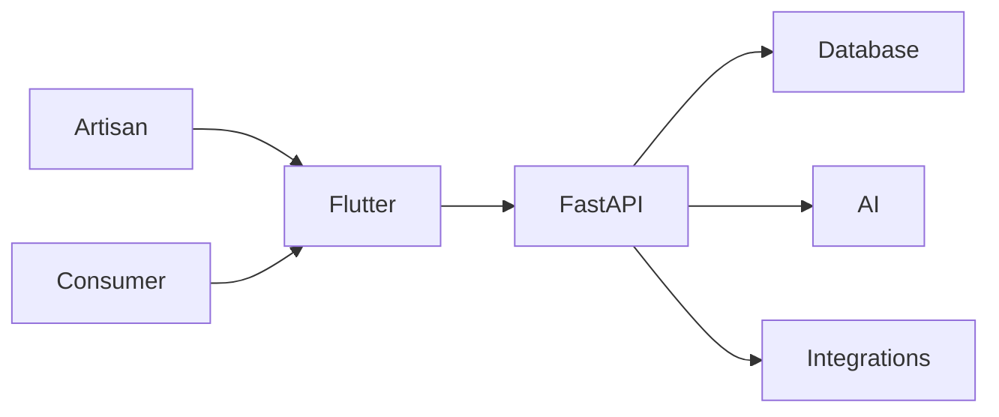

<div align="center">

# Craftsy

### Where Artisan Hands Meet Digital Markets

**An AI-powered companion that transforms a single photo and a spoken sentence into a professional, fairly-priced, bilingual product listing — purpose-built for India's rural artisans.**

*Smart India Hackathon 2026 · PS-90 · Heritage & Culture*

[](https://flutter.dev)
[](https://fastapi.tiangolo.com)
[](https://www.postgresql.org)
[](https://www.trychroma.com)
[]()
[](#license)

</div>

---

## 🚀 Try Craftsy

**Backend Health**
https://web-production-8ece9b.up.railway.app/api/v1/health

**Swagger API**
https://web-production-8ece9b.up.railway.app/docs

**OpenAPI Spec**
https://web-production-8ece9b.up.railway.app/openapi.json

**Android App**
`frontend/build/app/outputs/flutter-apk/app-release.apk` (v1.0.0, 85 MB, release build)

To publish a GitHub release, run:
```bash
gh release create v1.0.0 \
  --title "Craftsy 1.0.0 — Android Release" \
  --notes-file /tmp/release-notes.md \
  frontend/build/app/outputs/flutter-apk/app-release.apk
```

---

## What is Craftsy?

Craftsy is a Flutter mobile app paired with a FastAPI backend. It is built for artisans who sell handmade goods but lack the tools to list products online professionally.

The app guides an artisan through three steps:

1. Photograph the product
2. Speak a description in their regional language
3. Review and publish a bilingual (English + Hindi) listing

Behind the scenes, the backend runs computer-vision image enhancement, speech-to-text transcription, LLM-based listing generation, and a pricing engine that compares the product against indexed market data.

The project was built for Smart India Hackathon 2026, Problem Statement PS-90.

---

## The Problem

India's artisan economy includes millions of craftspeople. Seasonal markets like Shilp Samagam and Surajkund Mela provide temporary exposure, but sales stop when the event ends.

Four barriers keep artisans offline:

- **Photography** — e-commerce requires clean product photos. Most artisans do not have studio equipment.
- **Language** — most platforms require English or Hindi. Regional-language artisans struggle to write descriptions.
- **Pricing** — without market visibility, artisans underprice their work or lose margins to intermediaries.
- **Connectivity** — rural areas often have unreliable internet. Cloud-only apps fail during the first mile.

Craftsy targets all four at once: it processes photos and voice notes offline, in any supported Indian language, and produces a publishable listing with pricing guidance.

---

## What We Built

| Feature | Implementation |
|---|---|
| Artisan auth | Phone + OTP; SQLite in development, PostgreSQL in production |
| Product catalog | Full CRUD with image upload and offline sync |
| Image enhancement | rembg background removal, OpenCV lighting/crop, Pillow compositing |
| Voice listing | Whisper STT / Bhashini ASR, craft glossary biasing, Gemini/Groq listing generation |
| Pricing | Cost-floor calculator + ChromaDB benchmark retrieval |
| Commerce channels | ONDC and GeM channel metadata, status tracking, audit logging |
| Offline support | Hive local cache + WorkManager background sync queue |
| Accessibility | TTS readback, large text, haptic feedback, voice navigation |

---

## How It Works



The Flutter app handles all user-facing workflows: onboarding, product creation, marketplace browsing, orders, and settings. Local storage (Hive + Drift) keeps drafts and queued uploads available offline.

The FastAPI backend owns persistence, AI orchestration, and external integrations. SQLAlchemy models define `ArtisanDB`, `ProductDB`, `OrderDB`, and channel metadata tables.

AI services run in the `ML/` directory:

- `ML/image_pipeline/` — background removal and enhancement
- `ML/voice_pipeline/` — transcription, glossary, and product-draft generation
- `ML/pricing/` — cost extraction, ChromaDB benchmark retrieval, and price suggestion

---

## Technology Stack

| Layer | Technology | Purpose |
|---|---|---|
| Mobile | Flutter 3.x, Dart | Cross-platform client with offline-first local storage |
| State | Riverpod 2.x | Reactive state management |
| Local DB | Drift (SQLite), Hive | Offline queue and cached drafts |
| Background sync | WorkManager | Periodic drain of upload queue |
| Backend | FastAPI, SQLAlchemy 2.0 | REST API and ORM |
| Database | SQLite (local), PostgreSQL via Railway (production) | Persistent product, order, and artisan data |
| Vector store | ChromaDB | Embedding-based benchmark retrieval for pricing |
| Image pipeline | rembg, OpenCV, Pillow | Background removal, lighting correction, cropping |
| Speech-to-text | Whisper / Bhashini ASR | Regional-language transcription |
| Translation / listing | Gemini, Groq | Bilingual title, description, tags, and pricing rationale |
| Deployment | Railway | Continuous deployment of the FastAPI service |

---

## Getting Started

### Prerequisites

- Flutter SDK 3.x
- Python 3.11+
- Groq API key (optional)
- Google Gemini API key (optional)

### Backend

```bash
cd backend
python -m venv .venv
source .venv/bin/activate
pip install -r requirements.txt
cp ../.env.example .env
uvicorn main:app --reload --host 0.0.0.0 --port 8000
```

Railway uses the environment-variable form of the same settings. The app starts without external AI keys; features degrade gracefully when keys are missing.

### Frontend

```bash
cd frontend
flutter pub get
flutter run
```

### Build APK

```bash
cd frontend
flutter build apk --release \
  --dart-define=API_BASE_URL=https://YOUR-RAILWAY-DOMAIN
```

---

## Project Structure

```
craftsy/
├── frontend/
│   ├── lib/
│   │   ├── core/            # Theme, routing, offline sync, TTS
│   │   ├── data/            # Services, models, API clients
│   │   └── features/        # Screens and widgets per feature
│   ├── assets/              # Images, translations, fonts
│   └── test/                # Widget and unit tests
├── backend/
│   ├── routers/             # API endpoints
│   ├── services/            # Business logic and external integrations
│   ├── models/              # Pydantic schemas and SQLAlchemy models
│   └── tests/               # Integration tests
├── ML/
│   ├── image_pipeline/      # rembg, OpenCV, Pillow
│   ├── voice_pipeline/      # Whisper, Bhashini, glossary
│   └── pricing/             # Cost floor + ChromaDB RAG
├── docs/                    # Architecture and disclosure docs
├── submission/              # SIH submission materials
├── README.md
├── Dockerfile
├── railway.toml
└── requirements.txt
```

---

## Testing

```bash
# Backend
cd backend
.venv/bin/python -m pytest tests/ -q

# ONDC BPP adapter
.venv/bin/python -m pytest tests/test_ondc_bpp.py -v

# Frontend
cd frontend
flutter test
```

Backend results: `155 passed, 1 failed`. The single failure is `test_social_channels.py::test_independent_channels_generation_and_lookup`, a pre-existing issue unrelated to the ONDC work.

---

## Integrations

### ONDC

Craftsy implements a minimal Retail BPP (Seller) adapter for demo purposes. It exposes `/api/v1/ondc/search`, `/select`, `/init`, `/confirm`, and `/status` endpoints, and uses real `ProductDB`, `OrderDB`, and `ProductDB.stock` for catalogue, order creation, and stock safety.

The official `ONDC-Official/ondc-mock-server` was inspected but could not be started in this environment because its retail specification submodules did not finish initializing. A local protocol harness is used instead. This is a hackathon/mock integration; production ONDC participant onboarding and signing are not implemented.

See `ONDC_HACKATHON_DEMO.md` and `docs/history/` for implementation evidence.

### Bhashini

Bhashini provides REST ASR for regional-language transcription. The integration is functional for supported audio formats. WebSocket ASR remains blocked by upstream authentication/handshake issues.

### ChromaDB

Pricing uses ChromaDB in cloud mode to retrieve benchmark products by cosine similarity. The index is built from the `benchmark_products.json` dataset and queried with Gemini embeddings.

---

## Current Limitations

- ONDC is hackathon/mock only. No production registry onboarding or signing keys.
- Bhashini WebSocket ASR is blocked; REST ASR works.
- Some AI features require Groq/Gemini keys and degrade gracefully without them.
- Flutter `flutter analyze` reports pre-existing lint warnings.
- One backend test failure is pre-existing and unrelated to ONDC.

---

## License

Licensed under the [MIT License](LICENSE).
