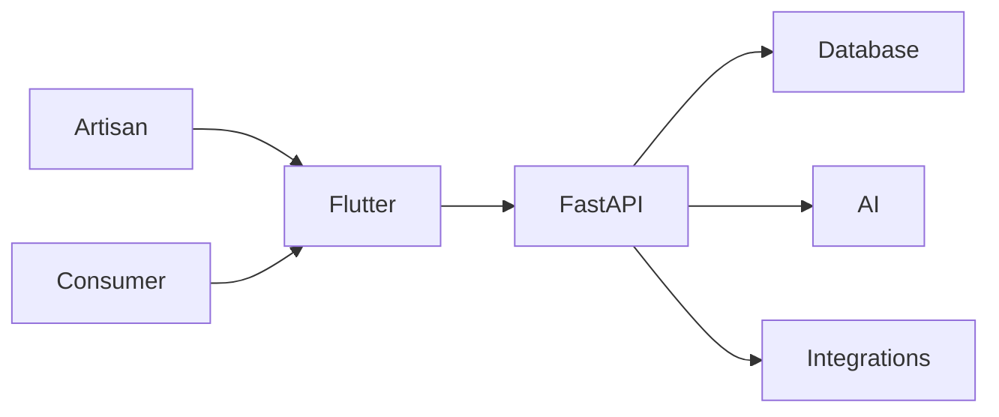

<div align="center">

# Craftsy

### Where Artisan Hands Meet Digital Markets

**An AI-powered companion that transforms a single photo and a spoken sentence into a professional, fairly-priced, bilingual product listing — purpose-built for India's rural artisans.**

*Smart India Hackathon 2026 · PS-90 · Heritage & Culture*

[](https://flutter.dev)
[](https://fastapi.tiangolo.com)
[](https://www.postgresql.org)
[](https://www.trychroma.com)
[]()
[](#license)

</div>

---

## What is Craftsy?

Craftsy is a Flutter mobile app paired with a FastAPI backend. It is built for artisans who sell handmade goods but lack the tools to list products online professionally.

The app guides an artisan through three steps:

1. Photograph the product
2. Speak a description in their regional language
3. Review and publish a bilingual (English + Hindi) listing

Behind the scenes, the backend runs computer-vision image enhancement, speech-to-text transcription, LLM-based listing generation, and a pricing engine that compares the product against indexed market data.

The project was built for Smart India Hackathon 2026, Problem Statement PS-90.

---

## The Problem

India's artisan economy includes millions of craftspeople. Seasonal markets like Shilp Samagam and Surajkund Mela provide temporary exposure, but sales stop when the event ends.

Four barriers keep artisans offline:

- **Photography** — e-commerce requires clean product photos. Most artisans do not have studio equipment.
- **Language** — most platforms require English or Hindi. Regional-language artisans struggle to write descriptions.
- **Pricing** — without market visibility, artisans underprice their work or lose margins to intermediaries.
- **Connectivity** — rural areas often have unreliable internet. Cloud-only apps fail during the first mile.

Craftsy targets all four at once: it processes photos and voice notes offline, in any supported Indian language, and produces a publishable listing with pricing guidance.

---

## What We Built

| Feature | Implementation |
|---|---|
| Artisan auth | Phone + OTP |
| Product catalog | Full CRUD with image upload and offline sync |
| Image enhancement | AI-powered background removal, lighting correction, and professional compositing |
| Voice listing | Speech-to-text transcription with regional-language support and craft-glossary biasing, powered by LLMs for bilingual title, description, and tags |
| Pricing | Cost-floor calculator with ChromaDB-powered market benchmark retrieval |
| Commerce channels | ONDC and GeM channel metadata, status tracking, and audit logging |
| Offline support | Local-first architecture with background sync queue |
| Accessibility | Text-to-speech readback, large-text mode, haptic feedback, and voice navigation |
| Business advisor | AI-driven suggestions for pricing, stock, and festival demand |

---

## How It Works



The Flutter app handles all user-facing workflows: onboarding, product creation, marketplace browsing, orders, and settings. Local storage keeps drafts and queued uploads available offline.

The FastAPI backend owns persistence, AI orchestration, and external integrations.

AI services run in the `ML/` directory:

- `ML/image_pipeline/` — background removal and enhancement
- `ML/voice_pipeline/` — transcription, glossary, and product-draft generation
- `ML/pricing/` — cost extraction, ChromaDB benchmark retrieval, and price suggestion

---

## Technology Stack

| Layer | Technology | Purpose |
|---|---|---|
| Mobile | Flutter, Dart | Cross-platform client with offline-first local storage |
| State | Riverpod | Reactive state management |
| Local DB | Hive | Offline queue and cached drafts |
| Background sync | WorkManager | Periodic drain of upload queue |
| Backend | FastAPI, SQLAlchemy 2.0 | REST API and ORM |
| Database | PostgreSQL | Persistent product, order, and artisan data |
| Vector store | ChromaDB | Embedding-based benchmark retrieval for pricing |
| Image pipeline | rembg, OpenCV, Pillow | Background removal, lighting correction, cropping |
| Speech-to-text | Whisper, Bhashini ASR | Regional-language transcription |
| Translation / listing | Gemini, Groq | Bilingual title, description, tags, and pricing rationale |
| Deployment | Railway | Continuous deployment of the FastAPI service |

---

## Project Structure

```
craftsy/
├── frontend/
│   ├── lib/
│   │   ├── core/            # Theme, routing, offline sync, TTS
│   │   ├── data/            # Services, models, API clients
│   │   └── features/        # Screens and widgets per feature
│   ├── assets/              # Images, translations, fonts
│   └── test/                # Widget and unit tests
├── backend/
│   ├── routers/             # API endpoints
│   ├── services/            # Business logic and external integrations
│   ├── models/              # Pydantic schemas and SQLAlchemy models
│   └── tests/               # Integration tests
├── ML/
│   ├── image_pipeline/      # rembg, OpenCV, Pillow
│   ├── voice_pipeline/      # Whisper, Bhashini, glossary
│   └── pricing/             # Cost floor + ChromaDB RAG
├── docs/                    # Architecture and disclosure docs
├── submission/              # SIH submission materials
├── README.md
├── Dockerfile
├── railway.toml
└── requirements.txt
```

---

## Integrations

### ONDC

Craftsy implements a minimal Retail BPP (Seller) adapter for demo purposes. It exposes `/api/v1/ondc/search`, `/select`, `/init`, `/confirm`, and `/status` endpoints, and uses real `ProductDB`, `OrderDB`, and `ProductDB.stock` for catalogue, order creation, and stock safety.

See `ONDC_HACKATHON_DEMO.md` and `docs/history/` for implementation evidence.

### Bhashini

Bhashini provides REST ASR for regional-language transcription. The integration is functional for supported audio formats.

### ChromaDB

Pricing uses ChromaDB in cloud mode to retrieve benchmark products by cosine similarity. The index is built from the `benchmark_products.json` dataset and queried with Gemini embeddings.

---

## Future Prospects

Craftsy is built as a living platform. The following capabilities are planned or in active exploration:

- **Production ONDC onboarding** — registry participant onboarding, cryptographic signing, and live transaction flow with official ONDC networks.
- **Expanded regional languages** — broader ASR and TTS coverage across more Indian languages and dialects.
- **Advanced analytics for artisans** — sales trends, buyer demographics, and seasonal demand forecasts.
- **Community and collaboration** — artisan collectives, shared storefronts, and cooperative pricing tools.
- **Multi-channel publishing** — direct publishing to ONDC, GeM, social commerce, and marketplace integrations.
- **Improved offline resilience** — smarter conflict resolution, delta sync, and larger offline media caching.
- **Personalized pricing intelligence** — richer market benchmarking, dynamic pricing suggestions, and margin optimization.
- **Design and branding tools** — AI-assisted product story generation, theme-based storefront customization, and marketing asset creation.

---

## License

Licensed under the [MIT License](LICENSE).
